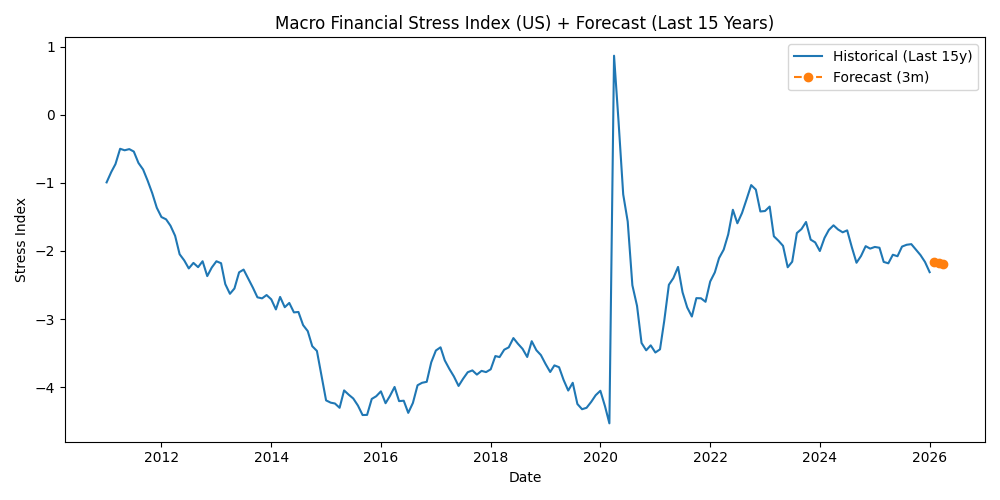

# 📊 Financial Data Intelligence & Macro Risk Automation System

### Financial Data Analyst Portfolio Project

This project demonstrates the design of an automated financial data intelligence pipeline that transforms raw macroeconomic data into structured risk signals and executive-level insights.

## 🚀 Business Problem

Financial decision-makers operate in highly dynamic macroeconomic environments where inflation shocks, rate changes, and labor market shifts directly impact forecasting accuracy and capital allocation.

However, macro monitoring is often manual, fragmented, and reactive.

This project simulates an enterprise-grade Financial Data Intelligence system that transforms raw macroeconomic data into structured, interpretable risk signals to support proactive financial decision-making.

## Overview

This project is an automated macro-financial analytics pipeline built in Python.

It retrieves real economic data from the Federal Reserve (FRED API), processes multiple macroeconomic indicators, applies a rule-based risk scoring model, and generates executive-level reports in Excel and PDF format.

The solution was designed to simulate a Financial Planning & Analysis (FP&A) macroeconomic monitoring tool capable of supporting strategic decision-making through data-driven insights and automated reporting.

---

## Data Sources

- Federal Reserve Economic Data (FRED)
- Indicators used:
  - CPI (Inflation)
  - Unemployment Rate
  - Federal Funds Rate
  - 10-Year Treasury Yield

---

## Key Features

- API-based data ingestion
- Monthly standardization of macroeconomic indicators
- Feature engineering (MoM, YoY, Rolling averages)
- Composite Macro Financial Stress Index (MFSI)
- Regime-based risk classification
- Strategic macroeconomic interpretation
- SQLite database storage
- SQL-based executive queries
- Automated Excel report with conditional styling
- Automated PDF executive brief
- Short-term stress forecasting (3-month regression)
- Full pipeline execution with logging

---

## Visual Output

### Macro Financial Stress Index (Last 15 Years + Forecast)



---

## Risk Engine Logic

The system assigns a macro risk score based on:

- Elevated inflation levels
- Rising unemployment momentum
- High policy interest rate environment
- Bond yield stress

A composite Macro Financial Stress Index (MFSI) is calculated using standardized macroeconomic variables.

The macro environment is then classified into risk regimes:

- VERY LOW
- LOW
- MODERATE
- ELEVATED
- CRITICAL

Each regime is mapped to a historical macroeconomic interpretation to support financial planning and scenario analysis.

---

## Outputs

- `reports/macro_us_report.xlsx`
- `reports/macro_us_executive_brief.pdf`
- `reports/macro_stress_index_full.png`
- `reports/macro_stress_index_recent.png`
- `data/processed/macro.db`
- `logs/automation.log`

---

---

## Financial Decision Impact

The system bridges raw macroeconomic volatility and structured financial interpretation.

It enables:

- Early detection of inflationary and tightening cycles
- Quantified macro stress monitoring via composite index
- Data-backed scenario comparison against historical stress regimes
- Automated executive reporting without manual spreadsheet manipulation

This demonstrates how Financial Data Analytics can directly support treasury planning, risk management, and capital strategy decisions.

## Business Application

This system simulates an automated macroeconomic monitoring tool that could support:

- Budget scenario planning
- Inflation monitoring
- Interest rate exposure analysis
- Capital expenditure review
- Strategic financial forecasting
- Risk-based portfolio allocation

By automating data collection, transformation, and reporting, the system reduces manual workload while improving analytical consistency and timeliness.

---

## How to Run

```bash
py run_pipeline.py
